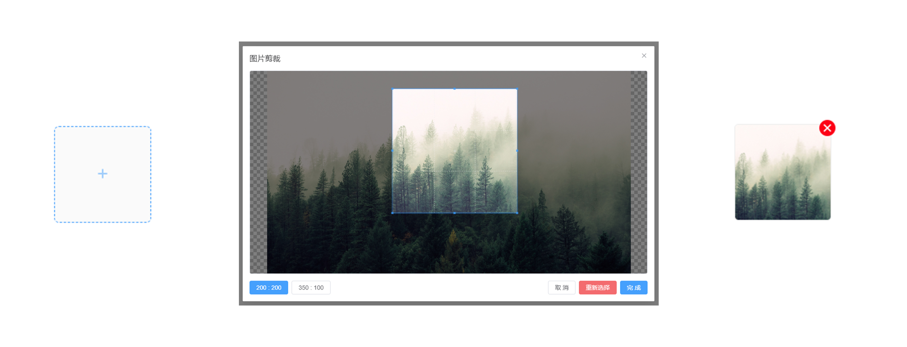

<h1 align="center">
vue-aspect-cropper
</h1>


`aspect-cropper` 是 `Vue` 图片裁剪组件，操作直观便捷，支持图片自定义比例裁剪.





## 功能特点

- 自定义裁剪比例
- 自由选择裁剪范围
- 使用 [cropperjs](https://fengyuanchen.github.io/cropperjs/) 作为裁剪库
- 基于 Vue3 + TS + ElementPlus

## 安装

```shell
npm add vue-aspect-cropper cropperjs
```

## 使用

```vue
<script setup lang="ts">
import { shallowRef, reactive } from "vue";
import vueAspectCropper from "vue-aspect-cropper";

const aspectCropperRef = shallowRef();
const cropperConfig = reactive({
  aspectRatioList: [
    { width: 200, height: 200 },
    { width: 350, height: 100 },
  ], //裁剪比例，可以添加多个
  maxSize: Infinity,
});

/**
 * 添加文件
 * */
function filesChange(event: Event) {
  const file = (event.target as HTMLInputElement).files![0];
  const url = URL.createObjectURL(file);
  aspectCropperRef.value?.openDialog(url, file.type);
}

const uploadfileRef = ref<HTMLInputElement | undefined>();
/**
 * 选择文件
 * */
function selectFile() {
  uploadfileRef.value!.value = "";
  uploadfileRef.value?.click();
}

/**
 * 裁剪完成
 * */
function cropperEnd(url: string) {}
</script>

<template>
  <div>
    <!-- 图片上传 -->
    <input ref="uploadfileRef" type="file" @change="filesChange($event)" />
    <!-- 裁剪弹窗 -->
    <vue-aspect-cropper
      ref="aspectCropperRef"
      :aspect-ratio-list="cropperConfig.aspectRatioList"
      :maxSize="cropperConfig.maxSize"
      @cropper-end="cropperEnd"
      @up-cropper-img="selectFile"
    ></vue-aspect-cropper>
  </div>
</template>
```
## 贡献指南
如果在使用过程中发现问题，欢迎在 [Issues](https://github.com/kacie-xiao/vue-aspect-cropper/issues) 中提出 如果喜欢的话，欢迎 **Star** 一下

## License

[MIT](./LICENSE) License &copy; 2024 [kacie](https://github.com/kacie-xiao)
